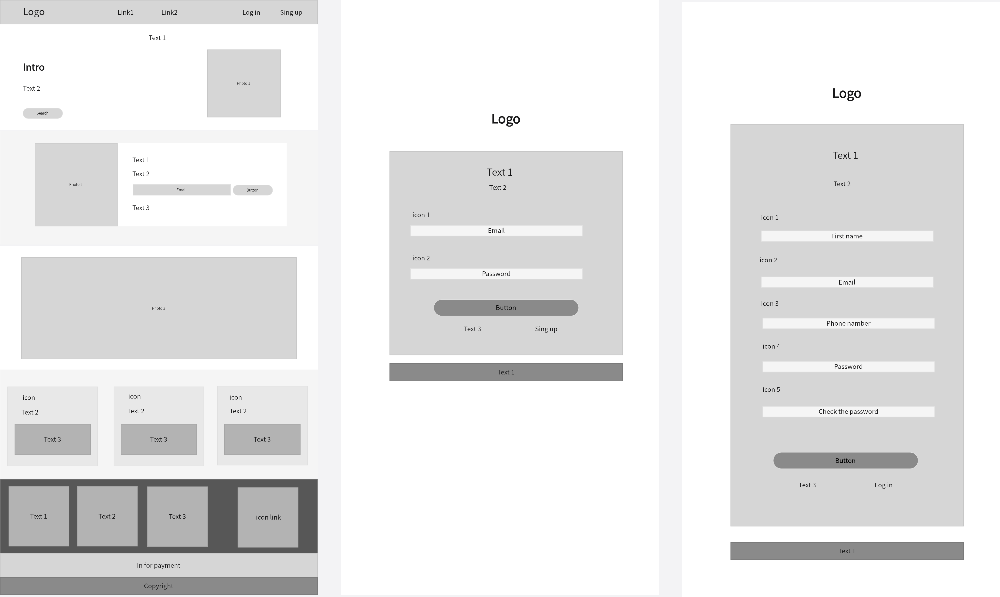
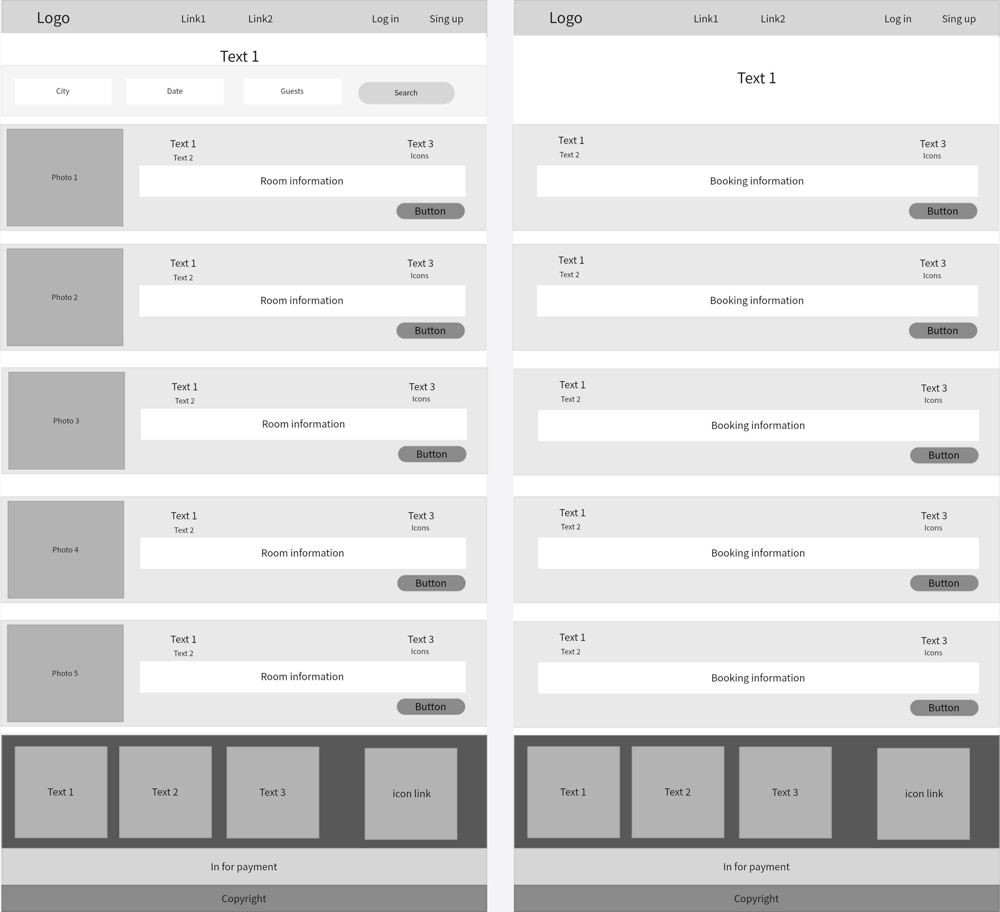

# booking_project

**Проект:** Веб-сервис для бронирования отелей (аналог Booking.com / Ostrovok.ru)

## О проекте
Этот проект представляет собой упрощенный клон сервиса бронирования отелей. Пользователи могут искать доступные отели, просматривать информацию о номерах и бронировать их. Владельцы отелей (или администраторы) могут управлять списком отелей, номерами и бронированиями.

---
## Авторы и роли

*   **Головчанский Владимир Александрович:** front/back-end
*   **Апостолова Мария Ильинична:** database, unit tests
*   **Стародубцева Анна Александровна:** website layout, unit tests, user stories

## Постановка задачи (Требования к продукту)

1.  **Технологический стек:**
    *   **Frontend/Backend:** Ruby on Rails
    *   **База данных:** PostgreSQL
    *   **Стилизация:** Tailwind CSS
    *   **Тестирование:** RSpec (unit-тесты, feature-тесты)

2.  **Основное условие:** Продукт должен быть разработан с использованием фреймворка Ruby on Rails (используется как для бэкенда, так и для рендеринга фронтенда через ERB-шаблоны).

3.  Код покрыт **unit-тестами** (модели, контроллеры). В идеале — наличие **feature-тестов** (системных тестов), проверяющих ключевые сценарии использования (например: "пользователь ищет отель и бронирует номер").

4.  **Внешний вид:** Основной упор делается на техническую реализацию и стабильность, но чистый, адаптивный и интуитивно понятный интерфейс приветствуется и будет плюсом.

---

## Макет сайта

---

## Функциональные требования (User Stories)

### Epic 1: Управление пользователями и аутентификация

### Story 1.1: Регистрация пользователя
**В роли** новый посетитель  
**Я хочу** создать аккаунт, используя email и пароль  
**Чтобы** иметь доступ к персонализированным функциям и бронированию.

**Критерии приемки:**
- Пользователь может перейти на страницу "Регистрация"
- Форма требует ввода email, пароля и подтверждения пароля
- Пароль должен соответствовать требованиям безопасности (минимум символов)

### Story 1.2: Вход в систему
**В роли** зарегистрированный пользователь  
**Я хочу** войти в аккаунт, используя email и пароль  
**Чтобы** управлять своими бронированиями и профилем.

**Критерии приемки:**
- Пользователь может перейти на страницу "Вход"
- Форма принимает email и пароль
- Отображается сообщение об ошибке при неверных учетных данных
- После успешного входа пользователь перенаправляется на главную страницу или предыдущую страницу

### Epic 2: Поиск отелей и номеров

### Story 2.1: Поиск отелей
**В роли** пользователь (гость или авторизованный)  
**Я хочу** искать отели по направлению, датам заезда/выезда и количеству гостей  
**Чтобы** найти подходящее жилье для моих поездок.

**Критерии приемки:**
- Форма поиска включает: направление (город/название отеля), дата заезда, дата выезда, количество взрослых, количество детей
- Календарь для выбора дат
- Страница результатов поиска отображает релевантные отели
- Отображается сообщение, если отели не найдены

**Комментарии:**
- Даты должны быть с валидацией (выезд позже заезда, не ранее сегодняшнего дня)
- Возраст детей важен для расчета стоимости и поиска подходящих номеров

### Story 2.2: Выбор номера
**В роли** пользователь  
**Я хочу** выбрать конкретный тип номера и увидеть его детали  
**Чтобы** понимать, что я бронирую.

**Критерии приемки:**
- Детали номера включают: площадь, тип кровати, максимальное количество гостей, удобства, фотографии
- Отображается актуальная доступность для выбранных дат
- Детализация цены: стоимость за ночь и общая сумма
- Доступны опции питания (завтрак включен, полупансион и т.д.), если применимо

### Epic 3: Бронирование и оформление

### Story 3.1: Процесс бронирования
**В роли** авторизованный пользователь  
**Я хочу** забронировать номер и указать данные гостей  
**Чтобы** подтвердить мою бронь.

**Критерии приемки:**
- Пошаговый процесс бронирования
- Форма данных гостя: полное имя, email, телефон, особые пожелания
- Подтверждение дат, типа номера и итоговой цены перед финальной отправкой
- Пользователь может просмотреть сводку бронирования
- Кнопка "Подтвердить бронирование" завершает резервирование

### Story 3.2: Управление бронированиями
**В роли** авторизованный пользователь  
**Я хочу** просматривать, изменять или отменять мои будущие бронирования  
**Чтобы** управлять изменениями в планах поездок.

**Критерии приемки:**
- Раздел "Мои бронирования" показывает все прошлые и предстоящие бронирования
- Для предстоящих бронирований доступны опции "Изменить" и "Отменить"
- Изменение позволяет менять даты или данные гостей (в зависимости от доступности)
- При отмене отображается сумма возврата согласно правилам отмены

### Epic 4: Избранное и персонализация

### Story 4.1: Добавление в избранное
**В роли** авторизованный пользователь  
**Я хочу** сохранять отели в список избранного  
**Чтобы** легко находить их позже без повторного поиска.

**Критерии приемки:**
- Иконка сердца на карточках отелей и на странице детального просмотра
- Клик переключает статус избранного
- Визуальная обратная связь при добавлении/удалении
- Избранные отели сохраняются в аккаунте между сессиями

**Комментарии:**
- Необходимо синхронизировать статус избранного на всех страницах

### Story 4.2: Управление избранным
**В роли** авторизованный пользователь  
**Я хочу** просматривать и управлять моими избранными отелями  
**Чтобы** просматривать сохраненные варианты и удалять ненужные.

**Критерии приемки:**
- Страница "Избранное" доступна из меню пользователя
- Отображаются все сохраненные отели с изображениями и основной информацией
- Кнопка "Проверить доступность" для каждого избранного отеля
- Доступна опция удаления из избранного

### Epic 5: Панель администратора

### Story 5.1: Аутентификация администратора
**В роли** администратор  
**Я хочу** входить в защищенную панель управления  
**Чтобы** управлять контентом и операциями платформы.

**Критерии приемки:**
- Роль администратора назначается для конкретных email-адресов

### Story 5.2: Управление отелями (CRUD)
**В роли** администратор  
**Я хочу** добавлять, редактировать и удалять отели  
**Чтобы** поддерживать актуальный каталог отелей.

**Критерии приемки:**
- Список всех отелей с поиском и фильтрами
- Форма добавления/редактирования отеля включает: название, описание, расположение, звездность, удобства, загрузку галереи
- Опция удаления с подтверждением и каскадным эффектом на связанные бронирования

**Комментарии:**
- Необходима предварительная модерация перед публикацией отеля
- Возможность импорта отелей из Excel/CSV (по возможности)

### Story 5.3: Управление номерами
**В роли** администратор  
**Я хочу** управлять номерами для каждого отеля  
**Чтобы** инвентарь корректно отражался пользователям.

**Критерии приемки:**
- Номера привязаны к конкретным отелям
- Управление: тип номера, количество, базовая цена, лимит гостей, удобства
- Блокировка дат для технического обслуживания или предотвращения перебронирования

**Комментарии:**
- Возможность устанавливать минимальный срок бронирования
- Настройка цен для разных категорий гостей (взрослые/дети)
- Автоматическое обновление инвентаря при массовых бронированиях

### Story 5.4: Управление бронированиями (Админ)
**В роли** администратор  
**Я хочу** просматривать и управлять всеми бронированиями  
**Чтобы** помогать клиентам и отслеживать заполняемость.

**Критерии приемки:**
- Дашборд со всеми бронированиями, фильтрация по отелю, диапазону дат, статусу
- Статус бронирования можно обновлять: ожидает, подтверждено, заселен, выселен, отменено
- Экспорт бронирований в CSV/Excel (по возможности)

**Комментарии:**
- Возможность массового обновления статусов
- Генерация отчетов по загрузке отелей

### Story 5.5: Управление пользователями (Админ)
**В роли** администратор  
**Я хочу** просматривать и управлять учетными записями пользователей  
**Чтобы** помогать с проблемами аккаунтов и отслеживать активность.

**Критерии приемки:**
- Список зарегистрированных пользователей с поиском и фильтрами
- Просмотр профиля пользователя и истории бронирований
- Отключение или удаление учетных записей при необходимости

### Story 5.6: Дашборд и аналитика (если успеваем)
**В роли** администратор  
**Я хочу** просматривать ключевые метрики производительности  
**Чтобы** понимать эффективность платформы и принимать решения на основе данных.

**Критерии приемки:**
- Дашборд показывает: общее количество бронирований, коэффициент заполняемости, выручку (неделя/месяц)
- Графики трендов бронирований и популярных отелей
- Лента недавней активности
- Быстрый доступ к частым задачам администратора

**Комментарии:**
- Возможность настройки периода отчета
- Экспорт аналитики в PDF/Excel
- Автоматические отчеты на email (еженедельно/ежемесячно)

---

## Разработка

### Установка и запуск
rails server
C:\Users\User\Desktop\ngrok.exe http 3000

---

### Тестирование
## Тест-кейсы

### Регистрация и авторизация

#### TC-AUTH-001: Регистрация нового пользователя с валидными данными

| Поле               | Значение |
|--------------------|----------|
| **Test Case ID**   | TC-AUTH-001 |
| **Priority**       | Высокий |
| **Title**          | Регистрация нового пользователя с валидными данными |
| **Preconditions**  | 1. Приложение развернуто и доступно по адресу http://localhost:3000 2. Пользователь не авторизован 3. Email anna@example.com не зарегистрирован в системе |
| **Test Data**      | Username: Стародубцева Анна Александровна Email: anna@example.ru Password: anna123 Password confirmation: anna123 Phone: 8 (999) 123-45-67 |
| **Steps**          | 1. Открыть главную страницу http://localhost:3000 2. Нажать кнопку «Регистрация» в шапке сайта 3. Ввести валидное имя пользователя в поле «ФИО» 4. Ввести валидный email в поле «Email» 5. Ввести номер телефона в поле «Телефон» 6. Ввести пароль в поле «Пароль» 7. Ввести подтверждение пароля в поле «Подтвердите пароль» 8. Нажать кнопку «Зарегистрироваться» |
| **Expected Result**| 1. Главная страница загружена 2. Открывается страница регистрации по пути /signup 3. Поле «ФИО» заполнено значением Стародубцева Анна Александровна 4. Поле «Email» заполнено значением anna@example.ru 5. Поле «Телефон» заполнено значением +7 (999) 123-45-67 6-7. Поля паролей заполнены (символы скрыты) 8. Происходит переход на главную страницу, в шапке сайта отображается вход в личный кабинет |
| **Status**         | Pass |

#### TC-AUTH-002: Валидация — регистрация с коротким username (<3 символов)

| Поле               | Значение |
|--------------------|----------|
| **Test Case ID**   | TC-AUTH-002 |
| **Priority**       | Средний |
| **Title**          | Регистрация с username менее 3 символов |
| **Preconditions**  | Пользователь не авторизован |
| **Test Data**      | Username: ab (2 символа), остальные поля валидны |
| **Steps**          | 1. Открыть главную страницу http://localhost:3000 2. Нажать кнопку «Регистрация» в шапке сайта 3. Ввести ab в поле «ФИО» 4. Заполнить остальные поля валидными данными 5. Нажать «Зарегистрироваться» |
| **Expected Result**| 1. Страница открыта 2. Поле username содержит ab 3. Остальные поля заполнены 4. Регистрация не выполнена. Отображается сообщение: «Минимальное количество символов: 3. Длина текста сейчас: 2». Пользователь в БД не создан |
| **Status**         | Pass |

#### TC-AUTH-003: Валидация — регистрация с коротким паролем (<6 символов)

| Поле               | Значение |
|--------------------|----------|
| **Test Case ID**   | TC-AUTH-003 |
| **Priority**       | Средний |
| **Title**          | Регистрация с паролем менее 6 символов |
| **Preconditions**  | Пользователь не авторизован |
| **Test Data**      | Password: 12345 (5 символов), остальные поля валидны |
| **Steps**          | 1. Открыть главную страницу http://localhost:3000 2. Нажать кнопку «Регистрация» в шапке сайта 3. Ввести 12345 в поле «Пароль» 4. Заполнить остальные поля валидными данными 5. Нажать «Зарегистрироваться» |
| **Expected Result**| 1. Страница открыта 2. Поле «Пароль» содержит 12345 3. Остальные поля заполнены 4. Регистрация не выполнена. Отображается сообщение: «Минимальное количество символов: 6. Длина текста сейчас: 5». Пользователь в БД не создан |
| **Status**         | Pass |

#### TC-AUTH-004: Валидация — регистрация с несовпадающими паролями

| Поле               | Значение |
|--------------------|----------|
| **Test Case ID**   | TC-AUTH-004 |
| **Priority**       | Средний |
| **Title**          | Регистрация с разными паролем и подтверждением |
| **Preconditions**  | Пользователь не авторизован |
| **Test Data**      | Пароль: pass123, подтверждение: pass456 |
| **Steps**          | 1. Открыть главную страницу http://localhost:3000 2. Нажать кнопку «Регистрация» в шапке сайта 3. Ввести pass123 в поле «Пароль» и pass456 в поле «Подтверждение» 4. Заполнить остальные поля валидными данными 5. Нажать «Зарегистрироваться» |
| **Expected Result**| 1. Страница открыта 2. Поле «Пароль» содержит pass123, поле «Подтверждение» содержит pass456 3. Остальные поля заполнены 4. Регистрация не выполнена. Отображается сообщение об ошибке |
| **Status**         | Fail |

#### TC-AUTH-005: Регистрация с уже существующим email

| Поле               | Значение |
|--------------------|----------|
| **Test Case ID**   | TC-AUTH-005 |
| **Priority**       | Средний |
| **Title**          | Регистрация пользователя с уже зарегистрированным email |
| **Preconditions**  | 1. Приложение развернуто и доступно 2. В базе данных существует пользователь с email anna@example.ru |
| **Test Data**      | Username: Иванов Иван Email: anna@example.ru Password: pas123 Password confirmation: pas123 |
| **Steps**          | 1. Открыть страницу регистрации 2. Ввести имя пользователя Иванов Иван 3. Ввести email anna@example.ru 4. Ввести пароль pas123 5. Ввести подтверждение пароля pas123 6. Нажать кнопку «Зарегистрироваться» |
| **Expected Result**| 1. Страница регистрации открыта 2-5. Поля заполнены 6. Регистрация не выполняется. Страница регистрации перезагружена, отображается сообщение об ошибке: «Email уже зарегистрирован» |
| **Status**         | Pass |

#### TC-AUTH-006: Вход пользователя с валидными учетными данными

| Поле               | Значение |
|--------------------|----------|
| **Test Case ID**   | TC-AUTH-006 |
| **Priority**       | Высокий |
| **Title**          | Авторизация пользователя с валидными email и паролем |
| **Preconditions**  | 1. Приложение развернуто и доступно 2. Пользователь не авторизован 3. Существует зарегистрированный пользователь с email anna@example.ru и паролем anna123 |
| **Test Data**      | Email: anna@example.ru Password: anna123 |
| **Steps**          | 1. Открыть главную страницу http://localhost:3000 2. Нажать кнопку «Войти» в шапке сайта 3. Ввести валидный email в поле «Email» 4. Ввести валидный пароль в поле «Пароль» 5. Нажать кнопку «Войти» |
| **Expected Result**| 1. Главная страница загружена 2. Открывается страница входа по пути /login 3. Поле «Email» заполнено значением anna@example.ru 4. Поле «Пароль» заполнено (символы скрыты) 5. Происходит переход на главную страницу, в шапке сайта отображается вход в личный кабинет |
| **Status**         | Pass |

#### TC-AUTH-007: Вход с неверным паролем

| Поле               | Значение |
|--------------------|----------|
| **Test Case ID**   | TC-AUTH-007 |
| **Priority**       | Средний |
| **Title**          | Авторизация с неверным паролем |
| **Preconditions**  | 1. Приложение развернуто и доступно 2. Пользователь не авторизован 3. Существует пользователь с email anna@example.ru |
| **Test Data**      | Email: anna@example.ru Password: 123 |
| **Steps**          | 1. Открыть страницу входа 2. Ввести валидный email anna@example.ru 3. Ввести неверный пароль 123 4. Нажать кнопку «Войти» |
| **Expected Result**| 1. Страница входа открыта 2. Поле «Email» заполнено 3. Поле «Пароль» заполнено 4. Авторизация не выполнена. Страница входа перезагружена, отображается сообщение «Неверный email или пароль». Пользователь остается неавторизованным |
| **Status**         | Pass |

#### TC-AUTH-008: Выход из системы

| Поле               | Значение |
|--------------------|----------|
| **Test Case ID**   | TC-AUTH-008 |
| **Priority**       | Средний |
| **Title**          | Выход авторизованного пользователя |
| **Preconditions**  | 1. Приложение развернуто и доступно 2. Пользователь авторизован 3. Существует пользователь с email anna@example.ru |
| **Test Data**      | — |
| **Steps**          | 1. Навести курсор на иконку пользователя в шапке страницы 2. В выпадающем меню нажать «Выйти» |
| **Expected Result**| 1. Выпадающее меню открыто 2. Происходит переход на главную страницу, в шапке снова отображаются кнопки «Войти» и «Регистрация» |
| **Status**         | Pass |

### Фильтрация отелей

#### TC-FILTER-001: Поиск отелей по датам и количеству гостей

| Поле               | Значение |
|--------------------|----------|
| **Test Case ID**   | TC-FILTER-001 |
| **Priority**       | Высокий |
| **Title**          | Фильтрация отелей с валидными датами и количеством гостей |
| **Preconditions**  | 1. Приложение развернуто и доступно 2. База данных заполнена тестовыми данными |
| **Test Data**      | Check-in: 20-07-2026 Check-out: 25-07-2026 Guests: 2 |
| **Steps**          | 1. Открыть страницу со списком отелей ( /hotels ) 2. В поле «Дата заезда» ввести значение 20-07-2026 3. В поле «Дата выезда» ввести значение 25-07-2026 4. В поле «Гости» ввести значение 2 5. Нажать кнопку «Поиск» |
| **Expected Result**| 1. Страница /hotels загружена 2. Поле «Дата заезда» заполнено значением 20-07-2026 3. Поле «Дата выезда» заполнено значением 25-07-2026 4. Поле «Гости» заполнено значением 2 5. Отображаются только отели, у которых есть номера с вместимостью не менее 2 гостей и свободные на выбранные даты. Для каждого отеля отображается количество доступных номеров. Если отелей нет — сообщение «Отели не найдены» |
| **Status**         | Pass |

#### TC-FILTER-002: Поиск отелей — нет доступных номеров

| Поле               | Значение |
|--------------------|----------|
| **Test Case ID**   | TC-FILTER-002 |
| **Priority**       | Средний |
| **Title**          | Поиск отелей, когда нет доступных номеров на выбранные даты |
| **Preconditions**  | 1. Приложение развернуто и доступно 2. База данных заполнена тестовыми данными |
| **Test Data**      | Check-in: 20-07-2026 Check-out: 25-07-2026 Guests: 20 (больше максимальной вместимости любого номера) |
| **Steps**          | 1. Открыть страницу /hotels 2. Ввести даты 20-07-2026 и 25-07-2026 3. Ввести количество гостей 20 4. Нажать кнопку «Поиск» |
| **Expected Result**| 1. Страница /hotels загружена 2-3. Поля заполнены 4. Отображается сообщение «Отели не найдены. Попробуйте изменить параметры поиска». Список отелей пуст |
| **Status**         | Pass |

#### TC-FILTER-003: Переход к номерам отеля с сохранением параметров поиска

| Поле               | Значение |
|--------------------|----------|
| **Test Case ID**   | TC-FILTER-003 |
| **Priority**       | Высокий |
| **Title**          | Просмотр номеров отеля с передачей параметров фильтрации |
| **Preconditions**  | 1. Приложение развернуто и доступно 2. Выполнен поиск отелей с параметрами (TC-FILTER-001) 3. Пользователь авторизован |
| **Test Data**      | — |
| **Steps**          | 1. На странице результатов поиска отелей найти любой отель 2. Нажать кнопку «Показать все номера» под карточкой отеля 3. Проверить URL страницы 4. Проверить отображение блока с выбранными параметрами на странице номеров |
| **Expected Result**| 1. Результаты поиска отображаются 2. Происходит переход на страницу отеля 3. В URL присутствуют параметры: check_in=2026-07-20&check_out=2026-07-25&guests=2 4. Вверху страницы отображается блок с выбранными датами и количеством гостей, а также кнопка «Сбросить». Отображаются только номера, доступные на эти даты и вмещающие указанное количество гостей |
| **Status**         | Pass |

### Бронирование отеля

#### TC-BOOK-001: Успешное бронирование номера авторизованным пользователем

| Поле               | Значение |
|--------------------|----------|
| **Test Case ID**   | TC-BOOK-001 |
| **Priority**       | Высокий |
| **Title**          | Авторизованный пользователь успешно бронирует номер |
| **Preconditions**  | 1. Приложение развернуто и доступно 2. Пользователь авторизован 3. Выбран отель без требований визы (например, «Гранд Отель») |
| **Test Data**      | Hotel: Гранд Отель Room: 101 (Эконом, 3500 ₽/ночь) Check-in: 01-08-2026 Check-out: 05-08-2026 Guests: 2 Guest name: Иванов Иван Guest phone: +7 (999) 111-22-33 |
| **Steps**          | 1. Авторизоваться под пользователем anna@example.ru 2. Перейти на страницу номеров отеля «Гранд Отель» 3. Нажать кнопку «Забронировать» у номера 101 4. В модальном окне ввести дату заезда 2026-08-01 5. Ввести дату выезда 2026-08-05 6. Убедиться, что количество гостей установлено 2 7. Ввести ФИО гостя Иванов Иван 8. Ввести телефон гостя +7 (999) 111-22-33 9. Нажать кнопку «Подтвердить» |
| **Expected Result**| 1. Пользователь успешно авторизован 2. Страница номеров загружена 3. Открыто модальное окно с формой бронирования 4-5. Поля дат заполнены 6. В блоке расчета отображается: цена за ночь (3500 ₽), количество ночей (4), итого (14000 ₽) 7-8. Поля ФИО и телефона заполнены 9. Отправлен запрос на бронирование, появляется уведомление от сайта «Бронирование успешно создано!» |
| **Status**         | Pass |

#### TC-BOOK-002: Попытка бронирования номера без авторизации

| Поле               | Значение |
|--------------------|----------|
| **Test Case ID**   | TC-BOOK-002 |
| **Priority**       | Высокий |
| **Title**          | Неавторизованный пользователь не может забронировать номер |
| **Preconditions**  | 1. Приложение развернуто и доступно 2. Пользователь НЕ авторизован |
| **Test Data**      | — |
| **Steps**          | 1. Открыть страницу hotels 2. Нажать кнопку «Показать все номера» у любого отеля 3. На карточке любого номера проверить состояние кнопки бронирования |
| **Expected Result**| 1. Страница hotels загружена 2. Происходит переход на страницу login, отображается сообщение «Войдите в свой аккаунт для продолжения» 3. После авторизации и повторного перехода на страницу номеров кнопка бронирования становится активной |
| **Status**         | Pass |

#### TC-BOOK-003: Блокировка бронирования для пользователей без визы (отель требует визу)

| Поле               | Значение |
|--------------------|----------|
| **Test Case ID**   | TC-BOOK-003 |
| **Priority**       | Высокий |
| **Title**          | Блокировка бронирования, если у пользователя нет визы, а отель требует визу |
| **Preconditions**  | 1. Приложение развернуто и доступно 2. Авторизован пользователь без визы 3. Выбран отель, требующий визу («Роял Палас») |
| **Test Data**      | — |
| **Steps**          | 1. Авторизоваться под пользователем anna@example.ru 2. Перейти на страницу отеля «Роял Палас» (Дубай) 3. Перейти в раздел номеров отеля 4. На карточке любого номера проверить состояние кнопки бронирования |
| **Expected Result**| 1. Пользователь успешно авторизован 2. Страница отеля загружена, на карточке отеля отображается бейдж «Требуется виза» 3. Страница номеров загружена 4. Вместо кнопки «Забронировать» отображается неактивный блок с текстом «Требуется виза». Бронирование невозможно |
| **Status**         | Pass |

#### TC-BOOK-004: Успешное бронирование отеля с требованием визы (пользователь с визой)

| Поле               | Значение |
|--------------------|----------|
| **Test Case ID**   | TC-BOOK-004 |
| **Priority**       | Высокий |
| **Title**          | Успешное бронирование отеля, требующего визу, пользователем с визой |
| **Preconditions**  | 1. Приложение развернуто и доступно 2. Авторизован пользователь с визой 3. Выбран отель, требующий визу («Роял Палас») |
| **Test Data**      | Hotel: Роял Палас Room: VIP-101 (Президентский Люкс, 50000 ₽/ночь) Check-in: 2026-07-20 Check-out: 2026-07-25 Guests: 2 Guest name: Иванов Иван Guest phone: +7 (999) 111-22-33 |
| **Steps**          | 1. Авторизоваться под пользователем anna@example.ru 2. Перейти на страницу номеров отеля «Роял Палас» 3. Нажать кнопку «Забронировать» у номера VIP-101 4. Заполнить форму бронирования валидными данными 5. Нажать кнопку «Подтвердить» |
| **Expected Result**| 1. Пользователь успешно авторизован 2. Страница номеров загружена, кнопка «Забронировать» активна (нет блокировки по визе) 3. Форма заполнена корректно 4. Бронирование успешно создано. Отсутствует ошибка о визе |
| **Status**         | Pass |

#### TC-BOOK-005: Попытка бронирования уже занятого номера

| Поле               | Значение |
|--------------------|----------|
| **Test Case ID**   | TC-BOOK-005 |
| **Priority**       | Средний |
| **Title**          | Бронирование номера, который уже забронирован на выбранные даты |
| **Preconditions**  | 1. Приложение развернуто и доступно 2. Пользователь авторизован 3. В БД существует бронирование для номера 101 отеля «Гранд Отель» на даты 2024-06-01 — 2024-06-05 |
| **Test Data**      | Hotel: Гранд Отель Room: 101 Check-in: 2024-06-02 Check-out: 2024-06-04 Guests: 2 |
| **Steps**          | 1. Авторизоваться под любым пользователем 2. Перейти на страницу номеров отеля «Гранд Отель» 3. У номера 101 нажать кнопку «Забронировать» 4. В модальном окне ввести перекрывающиеся даты (2024-06-02 — 2024-06-04) 5. Нажать кнопку «Подтвердить» |
| **Expected Result**| 1. Пользователь успешно авторизован 2. Страница номеров загружена 3. Модальное окно открыто 4. Даты введены 5. Отправлен запрос на бронирование, возвращается success: false с сообщением «Номер недоступен на выбранные даты или превышает вместимость». Появляется сообщение с текстом ошибки. Бронирование не создается |
| **Status**         | Pass |
